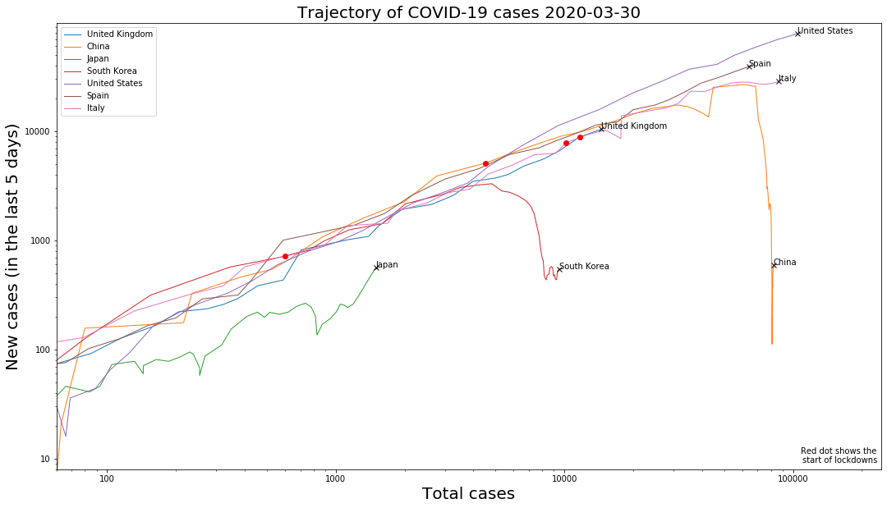
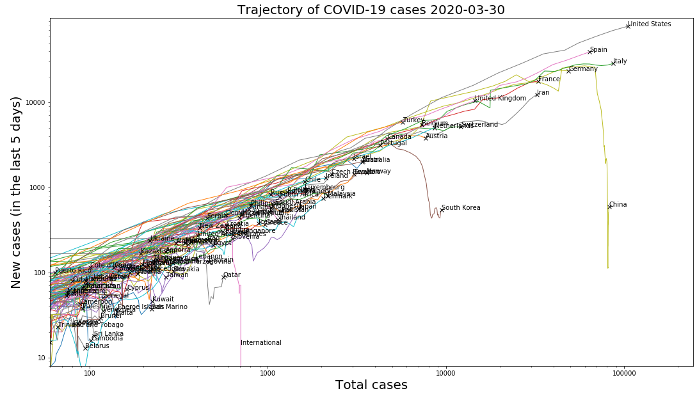

# COVID-19-Trajectory
## Use [V3](https://github.com/jagoosw/COVID-19-Trajectory/blob/master/V3.ipynb)
Plotting of twitter hashtags on top is also available at [V3-Twitter](https://github.com/jagoosw/COVID-19-Trajectory/blob/master/V3.ipynb) although I don't think it shows a correlation (various anti lockdown hashtags are up at the bottom of upward trends but I think thats probably just when talk of lockdowns etc is up in general).

I have made some graphs to show the trajectory of COVID 19. 

This project makes graphs showing the trajectory of COVID-19 around the world (such as the one below).
The total number of cases are plotted against the number of new cases in a partiucular time frame onto logged axes, this shows a suprisingly concistent rate of spread around the globe. The graph can then be used to see if a contries measures are actually helping to prevent the spread becuase the graph drops steaply when they get it under control.

This graph is some what more useful than looking at a timeseries or unlogged graph because it is very hard to see the change in them. There is obviously some lag in the graphs but the time frame can be reduced although this makes it messier. There is an inherent lag in any representation of this data because of the time from catching the virus to showing symptoms.

It also now has some time series plots and comparison to excess winter mortality but I don't really have time to write up anymore.

See [here](https://jagosw.medium.com/the-second-wave-is-real-e88e63dc1eb9) for details.

#The old version

The total number of cases are plotted against the number of new cases in a partiucular time frame onto logged axes, this shows a suprisingly concistent rate of spread around the globe. The graph can then be used to see if a contries measures are actually helping to prevent the spread becuase the graph drops steaply when they get it under control.

This graph is some what more useful than looking at a timeseries or unlogged graph because it is very hard to see the change in them. There is obviously some lag in the graphs but the time frame can be reduced although this makes it messier. There is an inherent lag in any representation of this data because of the time from catching the virus to showing symptoms.

This graph shows how all the contries are so similar.

See the notebook for a full explanation and examples or download and use the script file.

